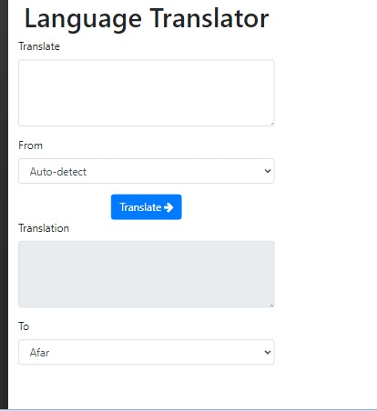

# LANGUAGE TRANSLATOR APP

The Language Translator App is a rails application that allows users to translate any language into other languages of their choice. The application provides the user with over one hundred languages and utilizes various endpoints.

#### Budget App Screenshots

<table>
  <tr>
    <td>Translator App</td>
  </tr>
  <tr>
    <td></td>
  </tr>
 </table>

# Getting Started


_To get a local copy up and running follow these simple steps._

1. Clone the repo
   ```sh
   git clone https://github.com/vic778/Google-Translator
   ```
2. Goto project directory
   ```sh
   cd budget-app
   ```

3. Configure `database.yml` in the config folder according to your postgreSQL configuration
4. Run app
   ```sh
   rails server
   ```
   or
   ```sh
   rails s
   ```


# Testing

`bundle exec rspec` will run all the tests.

Also, you can run `bundle exec rspec spec/` to run specific test.

You can also run `RAILS_ENV=test rspec spec/` to run the tests in test mode.

## Errors

If you encounter any errors, run the following commands.

- Run `rails db:drop db:create db:migrate` to drop, create and migrate a new database.

- Run `rubocop && rubocop -A` to check for and fix code errors.

# This project was built with

- Ruby on Rails

- PostgreSQL

- Bootstrap CSS Framework

# Author

👤 **Victor Barh**

- GitHub: [@Vvic778](https://github.com/vic778)
- Twitter: [@victoirBarh](https://twitter.com/)
- LinkedIn: [LinkedIn](https://linkedin.com/in/victoir-barh)

# 🤝 Contributing

Contributions, issues, and feature requests are welcome!

Feel free to check the [issues page](https://issues).

# Show your support

Give a ⭐️ if you like this project!

# Acknowledgement

- Hat tip to anyone whose code was a source of inspiration.

# 📝 License

This project is [MIT](./MIT.md) licensed.